# 1. Introduction

## 1.1 Background

The hospitality industry has undergone a significant transformation with the advent of online hotel reservation channels. These platforms have revolutionized the way hotel bookings are made and have led to changes in customer behavior. As a result, hotels have had to adapt their strategies to accommodate these new booking trends.

## 1.2 Problem Statement

One of the challenges faced by hotels is the high number of reservation cancellations or no-shows. There are various reasons why guests cancel their reservations, such as changes in plans or conflicting schedules. To attract customers, many hotels offer flexible cancellation policies, allowing guests to cancel free of charge or at a low cost. While this benefits the guests, it can pose revenue challenges for hotels.

## 1.3 Objective

The objective of this analysis is to explore a dataset called "Hotel Reservation.csv" and leverage machine learning classification models to gain insights into reservation cancellations. By understanding the factors that contribute to cancellations, hotels can make informed decisions to optimize their revenue and operational strategies.

## 1.4 Data Overview

The "Hotel Reservation.csv" dataset contains 36275 rows and 19 columns. Each row represents a hotel reservation, and the columns provide information about the reservation details, guest demographics, and booking attributes. The dataset will serve as the foundation for our analysis and machine learning modeling.

# 2. Analysis

Fig. 1: Variables Correlation table

The table indicates that there are minimal correlations among the variables, except for the relationship between repeated_guests and their previous bookings, which is likely attributed to scheduling delays.

## 2.1 Data Exploration

### **Categorical Variables**

The analysis of categorical variables provides insights into the booking preferences and patterns of the hotel's guests.

Fig. 2: Booking preferences 1

- **Rooms**: The majority of reservations are made for rooms with two adults and without children.

- **Booking Duration**: Reservations are primarily short-term, with fewer long-term bookings.

- **Meal Plan and Car Space**: Most guests select Meal Plan 1 and do not require a car space.

- **Room Types**: The most frequently booked room types are Types 1 and 4.

- **Booking Year**: The data predominantly corresponds to bookings made in 2018.

Fig. 3: Booking preferences 2

- **Bookings by Month**: There is a gradual increase in bookings from January to October, followed by a drop in November and December.

- **Booking Method**: The majority of bookings are made online.

- **Guests' History**: Guests who have never been to the hotel and have never canceled a booking are more likely to make reservations.

- **Special Requests**: The available data decreases as the number of special requests increases.

- **Cancellation Rate**: Approximately 65% of reservations have not been canceled.

### **Continuous Variables**

Analyzing continuous variables helps understand the numerical aspects of the booking data.

Fig. 4: Booking preferences 4

- **Lead Time**: Reservations are generally made without significant delays.

- **Lead Time and Reservations**: The longer the lead time, the lower the number of reservations.

- **Average Room Price**: The average price of a room is around 100 euros.

- **Cancellation History**: Guests typically have not canceled bookings before.

### **Bivariate Analysis: Relationship with Variables**

By examining the relationship between categorical variables and the likelihood of cancellation, several patterns emerge:

 

- **Parking Space and Previous Stay**: Guests who request a parking space or have stayed previously at the hotel are less likely to cancel their reservations.

- **Special Requests**: Guests who request special requests are also less likely to cancel. Moreover, as the number of special requests increases, the likelihood of cancellation decreases.

 
 

- **Lead Time**: The lead time, or the time between booking and check-in, shows a consistent relationship with the likelihood of cancellation across various categorical variables:
  - Guests requesting a parking space or those who have stayed before tend to have shorter lead times.
  - Guests with longer stays (3 or 4 nights) generally have longer lead times.
  - Guests with Meal Plan 2 exhibit higher lead times.
  - Different room types have varying lead times.
  - As the number of special requests increases, the lead time tends to decrease.
  - Guests who are already familiar with the hotel tend to have lower lead times.
 

- **Cancellations and Room Prices**: Higher-priced rooms tend to have a higher number of cancellations, and this pattern remains consistent throughout the year.

### **Other Insights**

- Lead time tends to be shorter at the beginning and end of the year.

- Guests who have previously canceled their bookings and guests who have not stayed at the hotel before follow similar patterns, with shorter lead times.

- Higher lead time corresponds to higher prices for cancellations.

These findings provide valuable insights into the relationship between categorical and continuous variables, shedding light on the preferences, behavior, and trends of the hotel's guests.

## 2.2 Algorithms and Techniques

In our machine learning project on hotel reservation prediction, we experimented with seven different models: K Neighbors, Naive Bayes - Gaussian, Decision Tree, Random Forest, Extra Trees, Gradient Boosting, and Neural Network. Each of these models employs a unique algorithm or technique to make predictions based on the input data.

- **K Neighbors**: This algorithm predicts the class of a data point by considering the class labels of its nearest neighbors. The number of neighbors to consider is determined by the value of 'k'. **Speed**: moderate, **Accuracy**: high

- **Naive Bayes - Gaussian**: This algorithm is based on Bayes' theorem and assumes that the features are conditionally independent. It uses the Gaussian distribution to model the likelihood of each feature given the class labels. **Speed**: fast, **Accuracy**: moderate

- **Decision Tree**: Decision trees partition the feature space based on a series of binary decisions. Each internal node represents a test on a specific feature, while each leaf node represents a class label. The decision tree algorithm learns an optimal tree structure from the training data. **Speed**: fast, **Accuracy**: moderate to high

- **Random Forest**: Random Forest is an ensemble learning method that combines multiple decision trees. It creates a set of decision trees on random subsets of the training data and makes predictions by averaging the outputs of individual trees. **Speed**: moderate, **Accuracy**: high

- **Extra Trees**: Extra Trees, similar to Random Forest, is an ensemble learning method that combines multiple decision trees. However, it further randomizes the tree construction process by selecting random splits at each node, aiming to increase diversity among the trees. **Speed**: moderate to fast, **Accuracy**: high

- **Gradient Boosting**: Gradient Boosting is an iterative ensemble method that builds a strong predictive model by sequentially adding weak models. Each weak model is trained to correct the mistakes made by the previous models, focusing on the instances that were misclassified. **Speed**: moderate to slow, **Accuracy**: high

- **Neural Network**: Neural networks are a class of models inspired by the structure and functioning of biological neural networks. They consist of interconnected layers of artificial neurons that process input data and learn to make predictions through a process called backpropagation. **Speed**: moderate to slow, **Accuracy**: high

## 2.3 Benchmark

To evaluate the performance of our models in predicting hotel reservation cancellations, we followed a standard practice of splitting the dataset into a training set and a test set. The dataset was divided at a ratio of 70% for training and 30% for testing. This splitting strategy ensures that the models are trained on a substantial amount of data while also allowing us to assess their performance on unseen data.

We employed the scikit-learn library to calculate the accuracy score and create a confusion matrix for evaluating the models. The accuracy score measures the proportion of correctly predicted cancellations or non-cancellations out of the total predictions. It provides an overall assessment of the model's predictive accuracy.

The confusion matrix was utilized to gain a more detailed understanding of the model's performance. It presents a tabular representation of predicted and actual classes, showing the true positive, true negative, false positive , and false negative values. 

This matrix allows us to calculate various evaluation metrics such as precision, recall, and F1 score and determine which model excels at predicting hotel reservation cancellations, where **precision** is the proportion of true positive predictions out of all positive predictions, **recall** is the proportion of true positive predictions out of all actual positive instances and **F1 score** is a measure that combines both precision and recall into a single metric.

To assess the overall perfomace, we also used **Macro Average**, which calculates the average performance across all classes without considering the class imbalance, treating regardless of their size or distribution, and **Weighted Average**, which calculates the average performance across all classes, taking into account the class imbalance, giveing more weight to the metrics of classes with a larger number of samples, reflecting their relative importance.

# 3. Methodology

## 3.1 Data Preprocessing

In this section, we will describe the steps taken to preprocess the data for machine learning models. The preprocessing steps include removing irrelevant features, encoding categorical variables, balancing the classes, scaling the data, and splitting it into training and testing sets.

- **Feature Removal**:
The *'Booking_ID'* feature is removed from the dataset as it does not provide any meaningful information for predicting the booking status.

- **Label Encoding**:
Categorical variables in the dataset are encoded into numeric form using the LabelEncoder from the scikit-learn library. This transformation allows the machine learning models to work with categorical data.

- **Class Balancing**:
As the dataset may have imbalanced classes, where one class has significantly more instances than the others, we apply oversampling using the RandomOverSampler from the imbalanced-learn library. This technique increases the number of instances in the minority class to achieve a balanced representation.

 

Fig.6: Post-balancing booking statuses

- **Data Scaling**:
To ensure that all features are on a similar scale and prevent any particular feature from dominating the learning process, we apply standard scaling using the StandardScaler from the scikit-learn library. This transformation standardizes the features to have zero mean and unit variance.

- **Data Split**:
The preprocessed data is split into training and testing sets using the train_test_split function from the scikit-learn library. We allocate 30% of the data for testing, while the remaining 70% is used for training the machine learning models.

## 3.2 Implementation

**NOTE**: reservation cancelled - denoted by class 0, not cancelled, denoted by class 1

### 1, K-NN

In this implementation, the K-Neighbors model was used to classify the data. The value of k determines the number of neighbors considered in the classification decision.

To ensure optimal performance on unseen data, we evaluate the model's performance using the cross-validation technique.

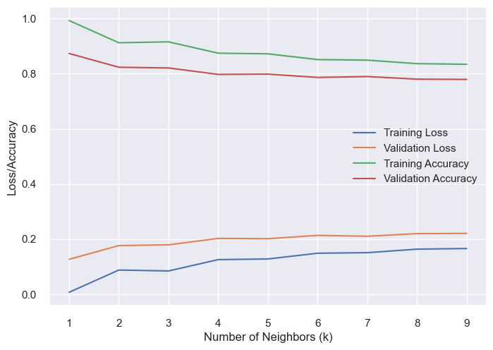 

Fig. 7: Loss/accuracy for different values of k

As the value of k increases, both the training accuracy and validation accuracy tend to decrease slightly. This can be attributed to the fact that increasing the number of neighbors introduces more noise or mislabeled points from the training set, affecting the model's performance.

The model achieved the highest training accuracy of 0.9929 for k = 1. However, the validation accuracy for this value of k is slightly lower at 0.8734, indicating a possible overfitting situation. Overfitting occurs when a model performs exceptionally well on the training dataset but struggles to generalize to unseen data.

The validation accuracy stabilizes after k = 4, with slight fluctuations in subsequent values. This suggests that a range of k values around 4 could be considered for potential model selection, as they provide reasonably good performance without overfitting to the training data.

The following are the training and validation accuracies for different values of k:

For k = 1: Training Accuracy = 0.9929, Validation Accuracy = 0.8734
For k = 2: Training Accuracy = 0.9123, Validation Accuracy = 0.8236
For k = 3: Training Accuracy = 0.9156, Validation Accuracy = 0.8209
For k = 4: Training Accuracy = 0.8745, Validation Accuracy = 0.7975
For k = 5: Training Accuracy = 0.8722, Validation Accuracy = 0.7986
For k = 6: Training Accuracy = 0.8513, Validation Accuracy = 0.7865
For k = 7: Training Accuracy = 0.8493, Validation Accuracy = 0.7897
For k = 8: Training Accuracy = 0.8365, Validation Accuracy = 0.7802
For k = 9: Training Accuracy = 0.8342, Validation Accuracy = 0.7793

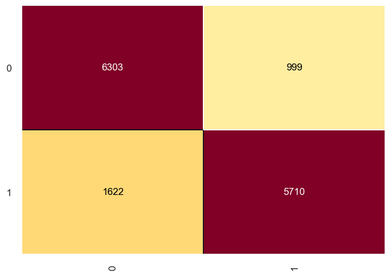 

Fig. 8: K-NN Confusion matrix

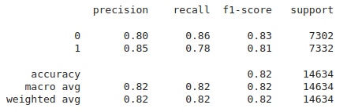 

Fig. 9: K-NN performance

Based on the results obtained, the model appears to perform reasonably well. After considering the training and validation accuracies, as well as the precision, recall, F1-score, and overall accuracy, a value of k = 3 was chosen for the K-Neighbors model. This value provides a good balance between performance and potential overfitting.

***Overall accuracy : 82%***

### 2, Naive Bayes - Gaussian Model

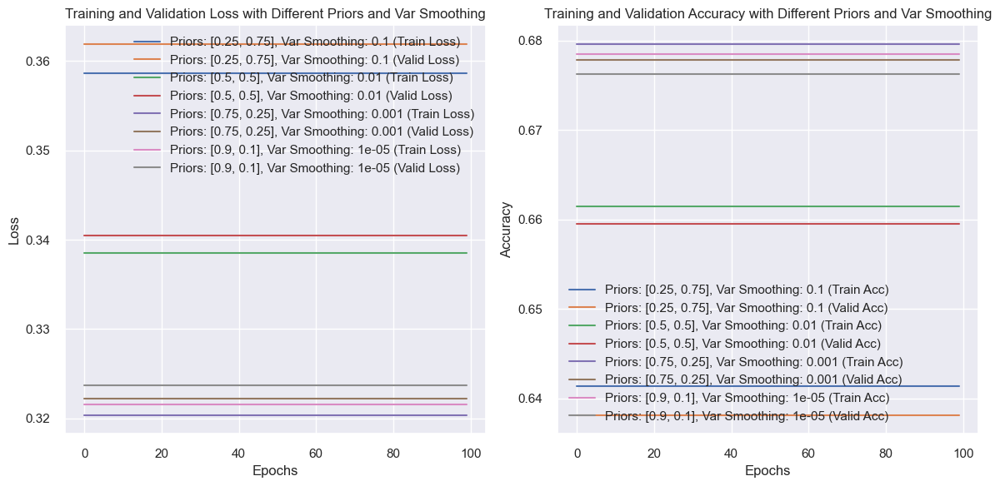 

Fig. 10: Hyperparameters smoothing

In this section, we implemented the Naive Bayes algorithm with a Gaussian model. Naive Bayes is a probabilistic machine learning algorithm that applies Bayes' theorem with the assumption of independence between the features. The Gaussian model assumes that the features in the dataset follow a Gaussian (normal) distribution.

After testing different parameters for priors and var_smoothing, we decided to use priors=[0.01,0.99] and var_smoothing=1e-6. The priors represent the probability distribution of the classes in the dataset, and var_smoothing is a smoothing parameter that helps prevent numerical instabilities when computing probabilities.

The Naive Bayes Gaussian model calculates the likelihood of a data point belonging to a particular class by estimating the probability density function (PDF) of each feature given the class. It then combines these likelihoods with the prior probabilities of the classes to make predictions.

The model's accuracy on the training data was 0.748, while the accuracy on the test/validation data was 0.744. Comparing these accuracy scores, it seems that the model is not overfitting as the accuracy on the training data is relatively similar to the accuracy on the test/validation data.

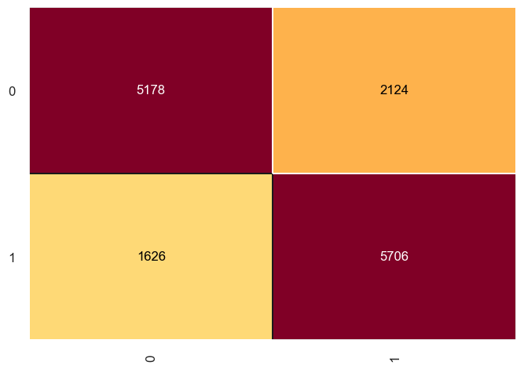 

Fig. 11: Confusion matrix

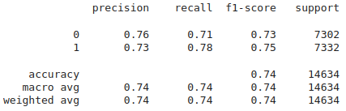 

Fig. 12: Performace

Regarding the metrics, we evaluated the model's performance for each class as well as an overall average (macro avg and weighted avg) across all classes. The precision, recall, and F1-score were relatively similar for both classes, indicating a balanced performance. However, the overall accuracy of 0.74 suggests that the model is correctly predicting approximately 74% of the instances in the dataset.

***Overall accuracy : 74%***

### 3, Decision Tree

In this section, we implemented the Decision Tree algorithm with two different calculations for splitting: Entropy and Gini. Decision Tree is a versatile machine learning algorithm that builds a tree-like model to make decisions based on feature values. The algorithm recursively splits the data based on selected features and thresholds, aiming to maximize information gain or impurity reduction.

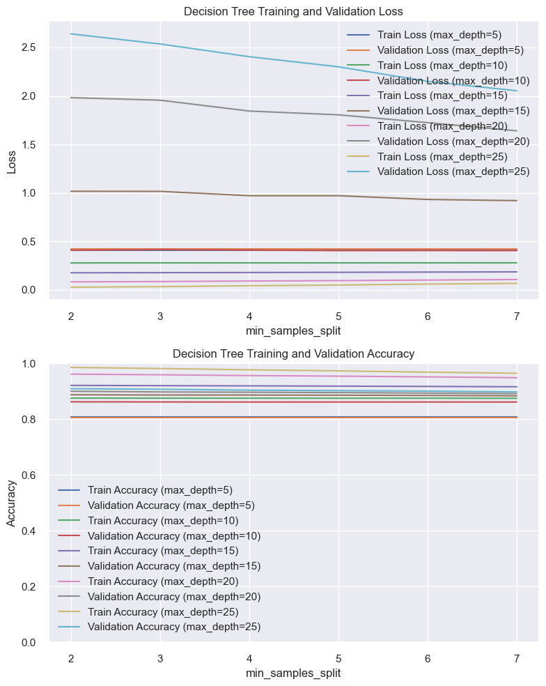 

Fig. 13: Decision Tree Hyperparameters

After experimenting with different hyperparameters such as criterion, min_samples_split, and max_depth, we have determined that the best configuration for our dataset is to use criterion='gini', min_samples_split=2, and max_depth=25. The criterion parameter defines the function to measure the quality of a split, and 'gini' calculates the Gini impurity. Min_samples_split determines the minimum number of samples required to split an internal node, and in our case, we found that a value of 2 yielded the best results. Additionally, setting max_depth to 25 limits the depth of the decision tree to prevent overfitting.

The decision tree model achieved an accuracy of 0.91 on the training data and 0.91 on the test/validation data. The similarity between these accuracy scores suggests that the model is not overfitting, as it performs consistently on both the training and test datasets.

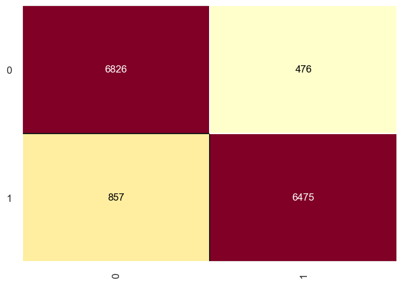 

Fig. 14: Confusion matrix

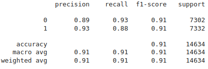 

Fig. 15: Performance

We evaluated the model's performance using various metrics, including precision, recall, and F1-score, for each class, as well as macro average and weighted average across all classes. The macro average and weighted average F1-scores were both 0.91, indicating consistent performance across classes and accounting for class imbalances. The precision and recall scores were also balanced for both classes, suggesting that the model performs well in predicting instances from each class.

***Overall accuracy : 91%***

### 4, Radom forest

In this section, we implemented the Random Forest algorithm, which is an ensemble learning method based on decision trees. Random Forest combines multiple decision trees and aggregates their predictions to make final decisions. This ensemble approach helps to improve the model's generalization and reduce overfitting.

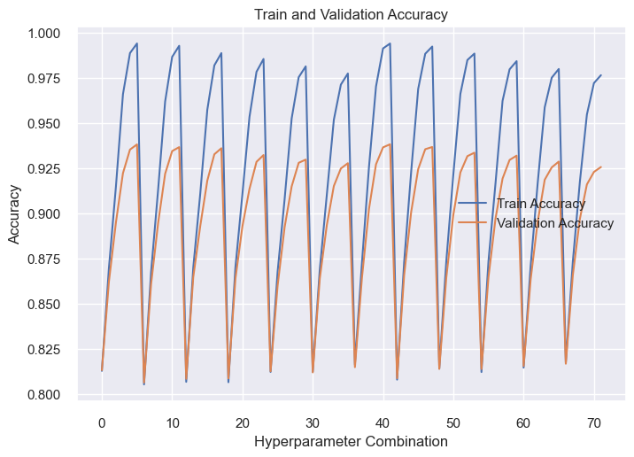 

Fig. 16: Random Forest Hyperparameters

We experimented with different hyperparameters to find the optimal configuration for our dataset. The hyperparameters we considered include the number of trees (n_estimators), the minimum number of samples required to split an internal node (min_samples_split), the maximum depth of the trees (max_depth), the criterion to measure the quality of a split (criterion), and the random seed (random_state).

After thorough experimentation, we determined that the best configuration for our dataset is as follows: n_estimators=100, min_samples_split=3, max_depth=30, criterion='gini', and random_state=0. These hyperparameters provided the best results in terms of overall accuracy and balanced performance across both classes.

The Random Forest model achieved an accuracy of 94% on the test/validation data. This high accuracy indicates that the model performs well in predicting the target variable for unseen instances.

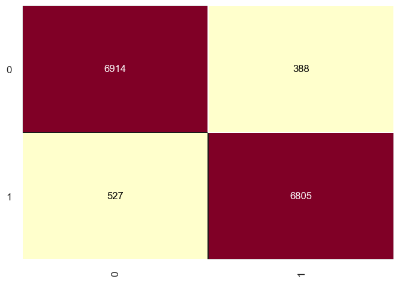 

Fig. 17: Confusion matrix

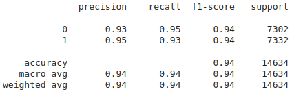 

Fig. 18: Performance

We evaluated the model's performance using various metrics, including precision, recall, and F1-score, for each class. The F1-scores for both classes were 0.94, indicating high performance in predicting instances from each class. The precision and recall scores were also balanced, further supporting the model's effectiveness in capturing instances from both classes.

The Random Forest algorithm produces such results due to its ability to leverage the diversity of multiple decision trees. By combining predictions from different trees and considering a variety of features and thresholds, Random Forest can capture complex relationships within the data and make accurate predictions. Furthermore, the randomness introduced in the training process, such as bootstrap sampling and feature subsampling, helps to reduce overfitting and improve the model's generalization capability, which are applied by default in the skit-learn library.

***Overall accuracy : 94%***

### 5, Extra trees

In this section, we implemented the Extra Trees algorithm, which is another ensemble learning method based on decision trees. Similar to Random Forest, Extra Trees combines multiple decision trees to make predictions. However, it differs from Random Forest in the way it constructs the trees and handles the randomness.

We experimented with various hyperparameters using GridSearch to find the optimal configuration for our dataset. The hyperparameters considered for Extra Trees include the number of trees (n_estimators), the criterion to measure the quality of a split (criterion), and the random seed (random_state).

We determined that the optimal configuration for our dataset is as follows: n_estimators=200, criterion='entropy', and random_state=0. These hyperparameters provided the best results in terms of overall accuracy and balanced performance across both classes.

The Extra Trees model achieved an accuracy of 95% on the test/validation data. This high accuracy indicates that the model performs well in predicting the target variable for unseen instances.

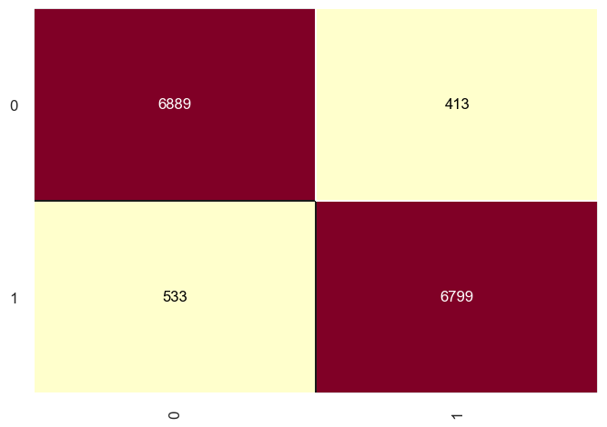 

Fig. 19: Confusion matrix

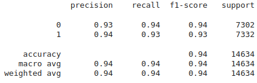 

Fig. 20: Performance

We evaluated the model's performance using various metrics, including precision, recall, and F1-score, for each class. The F1-scores for both classes were 0.94, indicating high performance in predicting instances from each class. The precision and recall scores were also balanced, further supporting the model's effectiveness in capturing instances from both classes.

The Extra Trees algorithm achieves such results by leveraging the diversity of multiple decision trees. It constructs each tree using random subsets of features and random thresholds, making the algorithm less sensitive to noisy features and improving its generalization capability. Additionally, skit-learn also employs bootstrap sampling by default, which further introduces randomness in the training process and helps prevent overfitting.

***Overall accuracy: 94%***

### 6, Gradient Boosting

We explored the application of Gradient Boosting to our dataset due to the limited predictive power of the variable. Gradient Boosting is an ensemble learning technique that combines weak learners, typically decision trees, to create a stronger and more accurate model. This is done by fitting the weak learner to the residuals (the differences between the predicted and actual values) of the previous model. The new weak learner is then combined with the previous models to make predictions

One of the key hyperparameters is the learning rate, which controls the contribution of each weak learner in the ensemble. The learning rate determines the step size at each iteration and affects the speed and accuracy of the model. The experiment involved testing different learning rates, starting from a wide range and narrowing down to identify the best suitable parameter.

We test the learning rate in different scope and narrow down slowly to find the best suitable parameter. The train loss and valid loss values are both relatively low and similar across different learning rates.

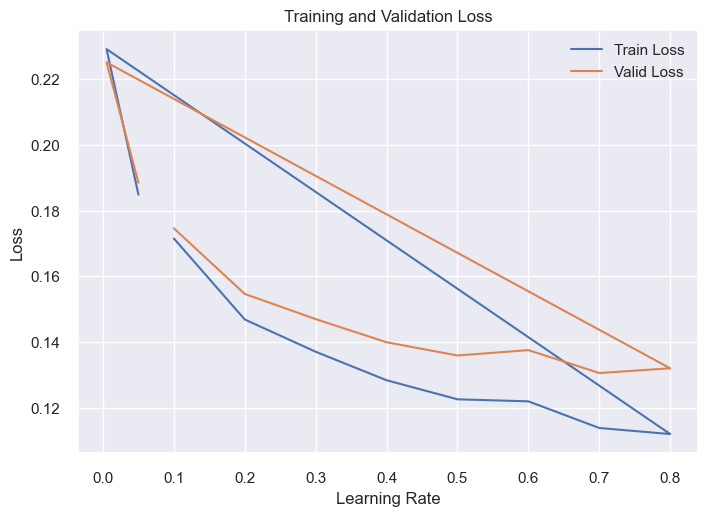 

Fig. 21: Hyperparameters

During our experimentation, we tuned the hyperparameters of the Gradient Boosting model. We set the hyperparameters as follows: n_estimators = 300, learning_rate = 0.7, and random_state = 0. This configuration yielded promising results.

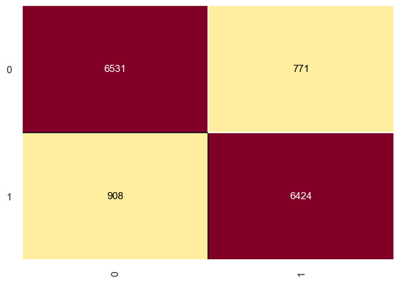 

Fig. 22: Confusion matrix

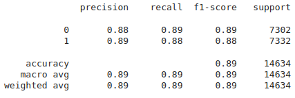 

Fig. 23: Performance

The model shows excellent accuracy and balanced performance for both classes, making accurate predictions. The precision values are 0.88 for class 0 and 0.89 for class 1, meaning that 88% and 89% of the predicted instances respectively are correct.

***Overall accuracy: 89%***

### 7, Neural Network
In this section, we employed a neural network (ANN) to address our problem. The neural network is inspired by biological neural networks in the human brain and consists of interconnected artificial neurons that process and learn from data.

During training, we initially set the model to train for 200 epochs with a learning rate of 0.01. We observed promising results in terms of training and validation loss up to 100 epochs. However, beyond that point, the loss and accuracy lines began to diverge, indicating overfitting, where the model becomes too specialized in the training data.

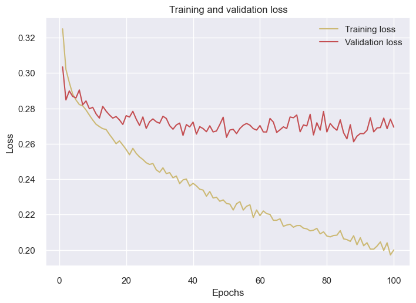 
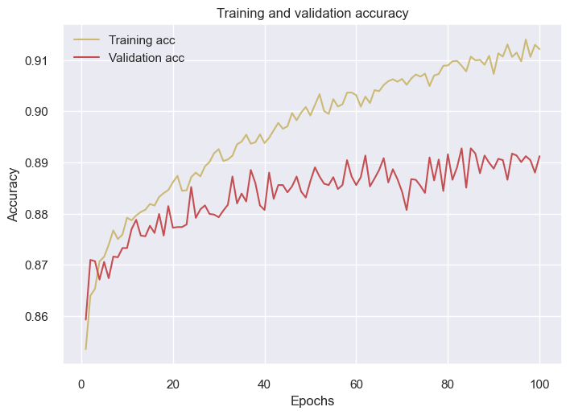 

To combat overfitting, we decided to stop training early at 100 epochs to prevent the model from memorizing the training data and encourage generalization. Additionally, we reduced the learning rate to 0.001. This adjustment allowed for finer weight adjustments, resulting in slower convergence but potentially greater precision. Lowering the learning rate also improved training stability and reduced the risk of overshooting the optimal solution.

By training the neural network with 100 epochs and a reduced learning rate of 0.001, we aimed to strike a balance between convergence speed and precision. This approach helped us capture meaningful patterns from the data while avoiding overfitting and unstable training dynamics.

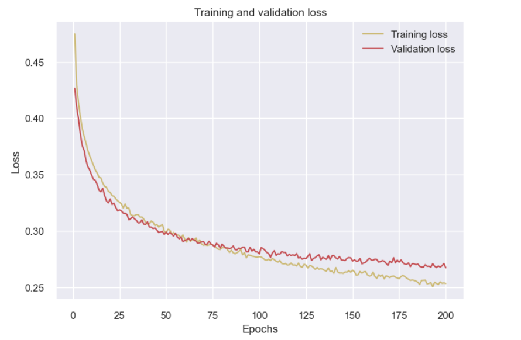 
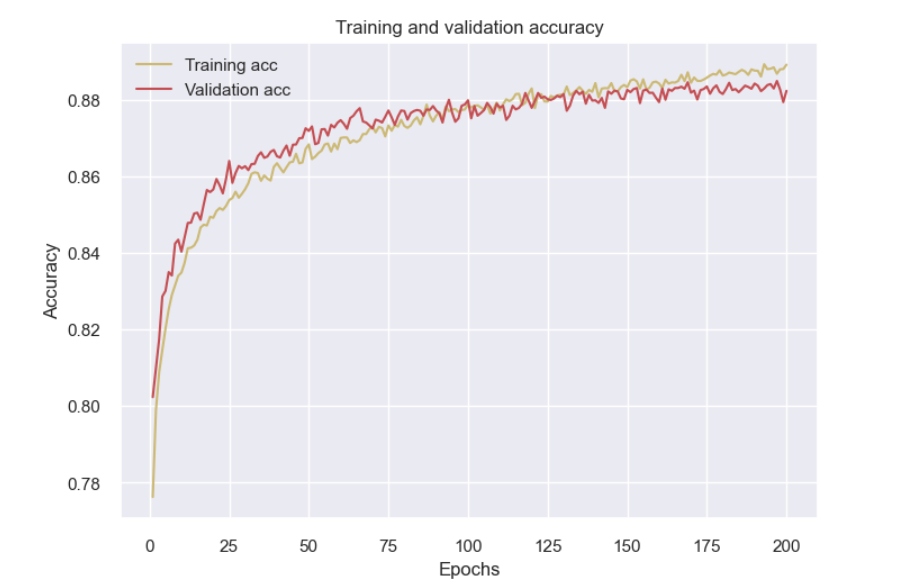 

***Overall accuracy : 87.87%***

# 4. Evaluation

Chi-square test

The chi-square test compares the observed frequencies of variables with the expected frequencies to assess whether the observed frequencies deviate significantly from what would be expected by chance.The goal of this test is to identify whether a disparity between actual and predicted data is due to chance or to a link between the variables under consideration. As a result, the chi-square test is an ideal choice for aiding in our understanding and interpretation of the connection between our two categorical variables.

Applying this method, we createe an instance of the SelectKBest class with the score_func parameter set to chi2, which indicates that the chi-squared statistic will be used as the scoring function to evaluate the importance of each feature.The fit method is called on the SelectKBest object, passing in the features and target variables as arguments. This calculates the chi-squared scores for each feature based on their relationship with the target variable.

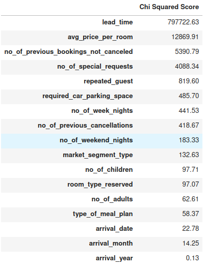 

The results so us that: The 'lead_time' feature has the highest chi-squared score of 797722.63, indicating a strong relationship or association with the target variable. This suggests that the lead time before making a reservation is an important factor in predicting the outcome.

The 'avg_price_per_room' feature has a relatively high chi-squared score of 12869.91, suggesting that it has a significant association with the target variable. This implies that the average price per room has predictive power in determining the outcome.

The 'no_of_special_requests', 'repeated_guest', and 'required_car_parking_space' features also have relatively high chi-squared scores, indicating their importance in predicting the outcome.

The 'arrival_year' feature has the lowest chi-squared score of 0.13, suggesting a weak association with the target variable. This indicates that the year of arrival alone might not be a strong predictor of the outcome.

The 'arrival_date' and 'arrival_month' features have relatively low chi-squared scores compared to other features. While they may still carry some predictive information, their importance might be less significant compared to other features.
Conclusion

Upon examining our data, we can observe that all the variables are numerical and continuous. Fortunately, our database contains a substantial amount of data, which simplifies our work. Furthermore, a thorough inspection reveals that we have no null values, and therefore no data treatment is required.

When considering correlations among the variables, we find that there is no strong correlation present. During our Exploratory Analysis, we did identify some outliers, but these did not impact the development of our model. Interestingly, we have noticed certain patterns in relation to reservations. Typically, most of the data follows a particular reservation pattern. Additionally, when examining our target variable, which distinguishes between canceled and non-canceled reservations, we have discovered some noteworthy patterns. Notably, the lead_time variable appears to be highly influential, as reservations with a longer lead time are more prone to cancellation. We have also uncovered other interesting insights, such as guests who have previously stayed and those who request specific amenities, like a car space or special accommodations, being less likely to cancel their reservations.

Analyzing the lead_time variable further, we observe a similar pattern to the target variable. Generally, reservations that were not canceled tend to have a shorter lead time. However, there are some specificities worth mentioning. For instance, during the first three and last three months of the year, the lead time tends to be shorter. Additionally, guests who order a specific type of food tend to have a longer lead time. Furthermore, when comparing the lead_time variable with the average cost of the room, we find that reservations with higher room prices and longer lead times are more inclined towards cancellation.

Regarding the machine learning models, we encountered an imbalance in the classes, as we have significantly more non-cancellation data compared to cancellations. To address this, we utilized oversampling techniques. Upon running the models, we observed a mix of subpar and exceptional performance. The best-performing model was the Random Forest model, which achieved an accuracy of 93.74% and was able to predict both cancellation and non-cancellation results effectively.

In terms of the most important variables for our machine learning models, the lead_time variable proved to be the most influential, followed by average room price and the number of special requests. This finding aligns with our earlier suspicions and is further validated by our data analysis

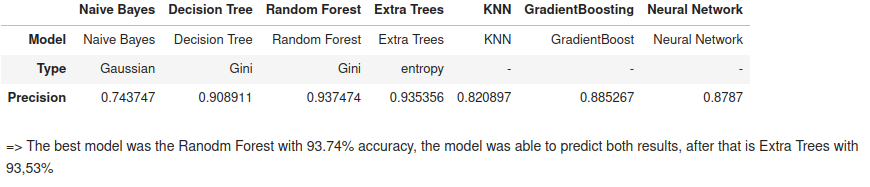 

# Phân công công việc
- Nguyễn Huy Hoàng     - 20214959 | Dataset finding, data analysis, data preparation, model training + evaluation
- Nguyễn Nhật Minh     - 20210582 | Report + QA, Naive Bayes
- Bùi Nguyễn Quang Huy - 20210436 | Slides, K-nn
