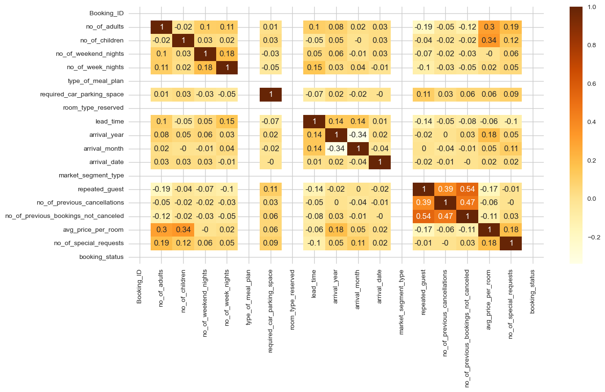

# Machine Learning Project Report

## 1. Introduction

### 1.1 Background

The hospitality industry has undergone a significant transformation with the advent of online hotel reservation channels. These platforms have revolutionized the way hotel bookings are made and have led to changes in customer behavior. As a result, hotels have had to adapt their strategies to accommodate these new booking trends.

### 1.2 Problem Statement

One of the challenges faced by hotels is the high number of reservation cancellations or no-shows. There are various reasons why guests cancel their reservations, such as changes in plans or conflicting schedules. To attract customers, many hotels offer flexible cancellation policies, allowing guests to cancel free of charge or at a low cost. While this benefits the guests, it can pose revenue challenges for hotels.

### 1.3 Objective

The objective of this analysis is to explore a dataset called "Hotel Reservation.csv" and leverage machine learning classification models to gain insights into reservation cancellations. By understanding the factors that contribute to cancellations, hotels can make informed decisions to optimize their revenue and operational strategies.

### 1.4 Data Overview

The "Hotel Reservation.csv" dataset contains 36275 rows and 19 columns. Each row represents a hotel reservation, and the columns provide information about the reservation details, guest demographics, and booking attributes. The dataset will serve as the foundation for our analysis and machine learning modeling.

## 2. Analysis

Fig. 1: Variables Correlation table

### 2.1 Data Exploration (Work in progress)

**Categorical Variables**

The analysis of categorical variables provides insights into the booking preferences and patterns of the hotel's guests.

- **Rooms**: The majority of reservations are made for rooms with two adults and without children.

- **Booking Duration**: Reservations are primarily short-term, with fewer long-term bookings.

- **Meal Plan and Car Space**: Most guests select Meal Plan 1 and do not require a car space.

- **Room Types**: The most frequently booked room types are Types 1 and 4.

- **Booking Year**: The data predominantly corresponds to bookings made in 2018.

- **Bookings by Month**: There is a gradual increase in bookings from January to October, followed by a drop in November and December.

- **Booking Method**: The majority of bookings are made online.

- **Guests' History**: Guests who have never been to the hotel and have never canceled a booking are more likely to make reservations.

- **Special Requests**: The available data decreases as the number of special requests increases.

- **Cancellation Rate**: Approximately 65% of reservations have not been canceled.

**Continuous Variables**

Analyzing continuous variables helps understand the numerical aspects of the booking data.

- **Lead Time**: Reservations are generally made without significant delays.

- **Lead Time and Reservations**: The longer the lead time, the lower the number of reservations.

- **Average Room Price**: The average price of a room is around 100 euros.

- **Cancellation History**: Guests typically have not canceled bookings before.

**Bivariate Analysis: Relationship with Categorical Variables**

By examining the relationship between categorical variables and the likelihood of cancellation, several patterns emerge:

- **Parking Space and Previous Stay**: Guests who request a parking space or have stayed previously at the hotel are less likely to cancel their reservations.

- **Special Requests**: Guests who request special requests are also less likely to cancel. Moreover, as the number of special requests increases, the likelihood of cancellation decreases.

- **Lead Time**: The lead time, or the time between booking and check-in, shows a consistent relationship with the likelihood of cancellation across various categorical variables:
  - Guests requesting a parking space or those who have stayed before tend to have shorter lead times.
  - Guests with longer stays (3 or 4 nights) generally have longer lead times.
  - Guests with Meal Plan 2 exhibit higher lead times.
  - Different room types have varying lead times.
  - As the number of special requests increases, the lead time tends to decrease.
  - Guests who are already familiar with the hotel tend to have lower lead times.

- **Cancellations and Room Prices**: Higher-priced rooms tend to have a higher number of cancellations, and this pattern remains consistent throughout the year.

**Other Insights**

- Lead time tends to be shorter at the beginning and end of the year.

- Guests who have previously canceled their bookings and guests who have not stayed at the hotel before follow similar patterns, with shorter lead times.

- Higher lead time corresponds to higher prices for cancellations.

These findings provide valuable insights into the relationship between categorical and continuous variables, shedding light on the preferences, behavior, and trends of the hotel's guests.

### 2.2 Algorithms and Techniques

### 2.3 Benchmark

## 3. Methodology

### 3.1 Data Preprocessing

### 3.2 Implementation

### 3.3 Refinement

## 4. Results

### 4.1 Model Evaluation and Validation

### 4.2 Justification

## 5. Conclusion

### 5.1 Free-Form Visualization

### 5.2 Reflection

### 5.3 Improvement
