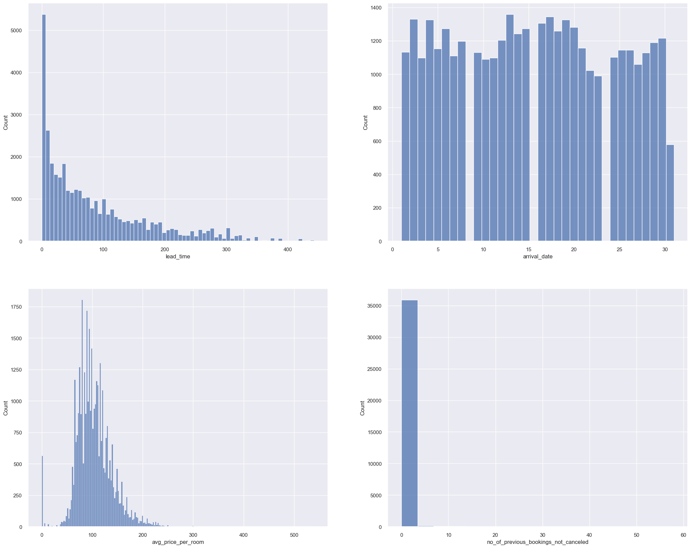

# Machine Learning Project Report

## 1. Introduction

### 1.1 Background

The hospitality industry has undergone a significant transformation with the advent of online hotel reservation channels. These platforms have revolutionized the way hotel bookings are made and have led to changes in customer behavior. As a result, hotels have had to adapt their strategies to accommodate these new booking trends.

### 1.2 Problem Statement

One of the challenges faced by hotels is the high number of reservation cancellations or no-shows. There are various reasons why guests cancel their reservations, such as changes in plans or conflicting schedules. To attract customers, many hotels offer flexible cancellation policies, allowing guests to cancel free of charge or at a low cost. While this benefits the guests, it can pose revenue challenges for hotels.

### 1.3 Objective

The objective of this analysis is to explore a dataset called "Hotel Reservation.csv" and leverage machine learning classification models to gain insights into reservation cancellations. By understanding the factors that contribute to cancellations, hotels can make informed decisions to optimize their revenue and operational strategies.

### 1.4 Data Overview

The "Hotel Reservation.csv" dataset contains 36275 rows and 19 columns. Each row represents a hotel reservation, and the columns provide information about the reservation details, guest demographics, and booking attributes. The dataset will serve as the foundation for our analysis and machine learning modeling.

## 2. Analysis

### 2.1 Data Exploration

### 2.2 Exploratory Visualization

Fig. 1: Variables Correlation table

Fig. 2

Fig. 3

Fig. 4

### 2.3 Algorithms and Techniques

### 2.4 Benchmark

## 3. Methodology

### 3.1 Data Preprocessing

### 3.2 Implementation

### 3.3 Refinement

## 4. Results

### 4.1 Model Evaluation and Validation

### 4.2 Justification

## 5. Conclusion

### 5.1 Free-Form Visualization

### 5.2 Reflection

### 5.3 Improvement
