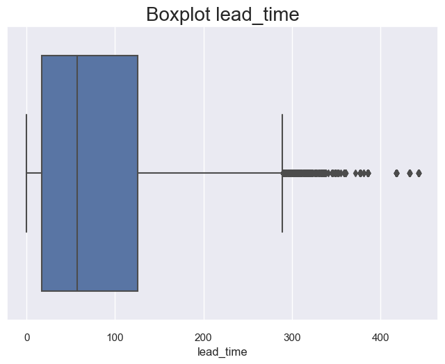

# 1. Introduction

## 1.1 Background

The hospitality industry has undergone a significant transformation with the advent of online hotel reservation channels. These platforms have revolutionized the way hotel bookings are made and have led to changes in customer behavior. As a result, hotels have had to adapt their strategies to accommodate these new booking trends.

## 1.2 Problem Statement

One of the challenges faced by hotels is the high number of reservation cancellations or no-shows. There are various reasons why guests cancel their reservations, such as changes in plans or conflicting schedules. To attract customers, many hotels offer flexible cancellation policies, allowing guests to cancel free of charge or at a low cost. While this benefits the guests, it can pose revenue challenges for hotels.

## 1.3 Objective

The objective of this analysis is to explore a dataset called "Hotel Reservation.csv" and leverage machine learning classification models to gain insights into reservation cancellations. By understanding the factors that contribute to cancellations, hotels can make informed decisions to optimize their revenue and operational strategies.

## 1.4 Data Overview

The "Hotel Reservation.csv" dataset contains 36275 rows and 19 columns. Each row represents a hotel reservation, and the columns provide information about the reservation details, guest demographics, and booking attributes. The dataset will serve as the foundation for our analysis and machine learning modeling.

# 2. Analysis

Fig. 1: Variables Correlation table

The table indicates that there are minimal correlations among the variables, except for the relationship between repeated_guests and their previous bookings, which is likely attributed to scheduling delays.

## 2.1 Data Exploration

### **Categorical Variables**

The analysis of categorical variables provides insights into the booking preferences and patterns of the hotel's guests.

Fig. 2: Booking preferences 1

- **Rooms**: The majority of reservations are made for rooms with two adults and without children.

- **Booking Duration**: Reservations are primarily short-term, with fewer long-term bookings.

- **Meal Plan and Car Space**: Most guests select Meal Plan 1 and do not require a car space.

- **Room Types**: The most frequently booked room types are Types 1 and 4.

- **Booking Year**: The data predominantly corresponds to bookings made in 2018.

Fig. 3: Booking preferences 2

- **Bookings by Month**: There is a gradual increase in bookings from January to October, followed by a drop in November and December.

- **Booking Method**: The majority of bookings are made online.

- **Guests' History**: Guests who have never been to the hotel and have never canceled a booking are more likely to make reservations.

- **Special Requests**: The available data decreases as the number of special requests increases.

- **Cancellation Rate**: Approximately 65% of reservations have not been canceled.

### **Continuous Variables**

Analyzing continuous variables helps understand the numerical aspects of the booking data.

Fig. 4: Booking preferences 4

- **Lead Time**: Reservations are generally made without significant delays.

- **Lead Time and Reservations**: The longer the lead time, the lower the number of reservations.

- **Average Room Price**: The average price of a room is around 100 euros.

- **Cancellation History**: Guests typically have not canceled bookings before.

Fig. 5: Outliers

The boxplots reveal the presence of outliers in both the **Lead Time** and **Average Room Price** variables, which will be addressed during the data cleaning process.

### **Bivariate Analysis: Relationship with Variables**

By examining the relationship between categorical variables and the likelihood of cancellation, several patterns emerge:

 

 
 

 

Fig. 6: Booking preferences and cancellation

- **Parking Space and Previous Stay**: Guests who request a parking space or have stayed previously at the hotel are less likely to cancel their reservations.

- **Special Requests**: Guests who request special requests are also less likely to cancel. Moreover, as the number of special requests increases, the likelihood of cancellation decreases.

- **Lead Time**: The lead time, or the time between booking and check-in, shows a consistent relationship with the likelihood of cancellation across various categorical variables:
  - Guests requesting a parking space or those who have stayed before tend to have shorter lead times.
  - Guests with longer stays (3 or 4 nights) generally have longer lead times.
  - Guests with Meal Plan 2 exhibit higher lead times.
  - Different room types have varying lead times.
  - As the number of special requests increases, the lead time tends to decrease.
  - Guests who are already familiar with the hotel tend to have lower lead times.

- **Cancellations and Room Prices**: Higher-priced rooms tend to have a higher number of cancellations, and this pattern remains consistent throughout the year.

### **Other Insights**

- Lead time tends to be shorter at the beginning and end of the year.

- Guests who have previously canceled their bookings and guests who have not stayed at the hotel before follow similar patterns, with shorter lead times.

- Higher lead time corresponds to higher prices for cancellations.

These findings provide valuable insights into the relationship between categorical and continuous variables, shedding light on the preferences, behavior, and trends of the hotel's guests.

## 2.2 Algorithms and Techniques

In our machine learning project on hotel reservation prediction, we experimented with seven different models: K Neighbors, Naive Bayes - Gaussian, Decision Tree, Random Forest, Extra Trees, Gradient Boosting, and Neural Network. Each of these models employs a unique algorithm or technique to make predictions based on the input data.

K Neighbors: This algorithm predicts the class of a data point by considering the class labels of its nearest neighbors. The number of neighbors to consider is determined by the value of 'K' specified by the user.

Naive Bayes - Gaussian: This algorithm is based on Bayes' theorem and assumes that the features are conditionally independent. It uses the Gaussian distribution to model the likelihood of each feature given the class labels.

Decision Tree: Decision trees partition the feature space based on a series of binary decisions. Each internal node represents a test on a specific feature, while each leaf node represents a class label. The decision tree algorithm learns an optimal tree structure from the training data.

Random Forest: Random Forest is an ensemble learning method that combines multiple decision trees. It creates a set of decision trees on random subsets of the training data and makes predictions by averaging the outputs of individual trees.

Extra Trees: Extra Trees, similar to Random Forest, is an ensemble learning method that combines multiple decision trees. However, it further randomizes the tree construction process by selecting random splits at each node, aiming to increase diversity among the trees.

Gradient Boosting: Gradient Boosting is an iterative ensemble method that builds a strong predictive model by sequentially adding weak models. Each weak model is trained to correct the mistakes made by the previous models, focusing on the instances that were misclassified.

Neural Network: Neural networks are a class of models inspired by the structure and functioning of biological neural networks. They consist of interconnected layers of artificial neurons that process input data and learn to make predictions through a process called backpropagation.

## 2.3 Benchmark (WIP)

The data set was split into a test set and a training set, at the ratio of 30/70. 

# 3. Methodology

## 3.1 Data Preprocessing

In this section, we will describe the steps taken to preprocess the data for machine learning models. The preprocessing steps include removing irrelevant features, encoding categorical variables, balancing the classes, scaling the data, and splitting it into training and testing sets.

- **Feature Removal**:
The *'Booking_ID'* feature is removed from the dataset as it does not provide any meaningful information for predicting the booking status.

- **Label Encoding**:
Categorical variables in the dataset are encoded into numeric form using the LabelEncoder from the scikit-learn library. This transformation allows the machine learning models to work with categorical data.

- **Class Balancing**:
As the dataset may have imbalanced classes, where one class has significantly more instances than the others, we apply oversampling using the RandomOverSampler from the imbalanced-learn library. This technique increases the number of instances in the minority class to achieve a balanced representation.

 

Fig.7: Post-balancing booking statuses

- **Data Scaling**:
To ensure that all features are on a similar scale and prevent any particular feature from dominating the learning process, we apply standard scaling using the StandardScaler from the scikit-learn library. This transformation standardizes the features to have zero mean and unit variance.

- **Data Split**:
The preprocessed data is split into training and testing sets using the train_test_split function from the scikit-learn library. We allocate 30% of the data for testing, while the remaining 70% is used for training the machine learning models.

## 3.2 Implementation

## 3.3 Refinement

# 4. Results

## 4.1 Model Evaluation and Validation

## 4.2 Justification

# 5. Conclusion

## 5.1 Free-Form Visualization

## 5.2 Reflection

## 5.3 Improvement
